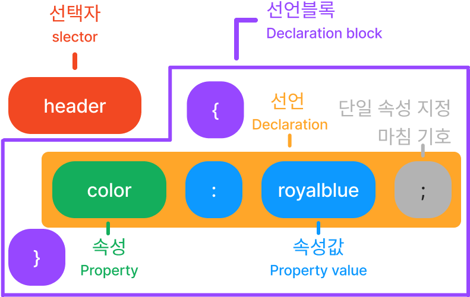

# CSS Basic

## CSS란?

CSS는 Cascading Style Sheet의 약자로 HTML이나 XML과 같은 마크업 언어로 작성한 문서의 스타일을 정의하는 언어이다.

## 작성 방법

<figure><figcaption></figcaption></figure>

## CSS 적용 방식

### 인라인 방식

```html
<p style="color: yellow;">Hello world</p>
```

### 내부 스타일

```markup
<style>
    p {
        color: yellow;
    }
</style>
```

### 외부 스타일&#x20;

* html 파일

<pre class="language-markup"><code class="lang-markup">&#x3C;!-- head > link 안에 있어야 한다 -->
&#x3C;!-- rel = relastions, href = hyper-references -->
&#x3C;head>
    &#x3C;!-- 기타 생략 -->
<strong>    &#x3C;link rel="stylesheet" href="style.css" /> 
</strong><strong>&#x3C;/head>
</strong></code></pre>

* css 파일&#x20;

```css
p {
    color: red;
}
```

## 선택자 기초

### 전체 선택자(`*`)

```css
* {
    margin: 0;
}
```

### 타입 선택자(`태그`)

```css
p {
    color: red;
}
```

### 아이디 선택자(`#`)

```css
#id {
    color: red;
}
```

### 클래스 선택자(`.`)

```css
.class {
    color: red;
}
```

### 특성 선택자(`[]`)

```css
[type='button'] {
    color: red;
}
```

### 그룹 선택자(`,`)

```css
h1, h2, h3 {
    color: red;
}
```

### 복합 선택자

#### 자손 선택자( )

```css
<!-- div의 모든 하위의 모든 p -->
div p {
    color: red;
}
```

<figure><figcaption></figcaption></figure>

#### 자식 선택자(`>`)

```css
div>p {
    color: red;
}
```

#### 일반 형제 선택자(`~`)

`~` 뒤에 나오는 형제 선택

```css
div ~ p {
    color: red;
}
```

<figure><figcaption></figcaption></figure>

#### 인접 형제 선택자(`+`)

`+` 는 바로 뒤에 인접한 형제만 선택한다.

```css
div + p {
    color: red;
}
```

<figure><figcaption></figcaption></figure>

### 동적 가상 클래스

* `:hover`  마우스가 오버했을 때

### 구조적 가상 선택자

* `:first-child`  형제 요소 그룹 중 첫번째 요소
* `:last-child` 형제 요소 그룹 중 마지막 요소
* `:nth-child(2)`  형제 요소 그룹 중 n에 해당하는 요소
* `::before` 선택한 요소의 내용 앞에 새로운 요소 만들어 작업할수 있다
* `::after` 선택한 요소의 내용 뒤에 새로운 요소 만들어 작업할수 있다


`::before 과 ::after 은 content 속성과 짝을 지어 사용하여 장식적인 요소를 추가하는데 사용한다. ,<br>,<input>에는 적용할 수 없다.`


## Text

### color 생삭

```css
color: red;
```

### font-family

```css
font-family: 'Noto Sans KR', sans-serif;
```

### font-size

```css
font-size: 10px;
```

<pre class="language-css"><code class="lang-css">font-weight: normal; /* 기본값 */
<strong>font-weight: bold; /* 굵게 */
</strong>font-weight: bolder; /* 더 굵게 */
font-weight: lighter; /* 더 가늘게 */
font-weight: 100; /* 숫자 값 */
</code></pre>

### text-align 텍스트  가로 정렬

```css
text-align: left; /* 왼쪽 정렬 */
text-align: right; /* 오른쪽 정렬 */
text-align: center; /* 가운데 정렬 */
text-align: justify; /* 양쪽 맞춤 (마지막 줄 제외)*/
text-align: justify-all; /* 양쪽 맞춤 */
```

### vertical-align 텍스트 세로 정렬

```css
vertical-align: baseline; /* 기본값 */
vertical-align: top; /* 위쪽 정렬 */
vertical-align: middle; /* 가운데 정렬 */
vertical-align: bottom; /* 아래쪽 정렬 */
vertical-align: text-top; /* 텍스트 위쪽 정렬 */
vertical-align: text-bottom; /* 텍스트 아래쪽 정렬 */
vertical-align: sub; /* 아래 첨자 */
vertical-align: super; /* 위 첨자 */
vertical-align: 10px; /* 길이 값 */
```

### line-height 행간 조정

```css
line-height: normal; /* 기본값 */
line-height: 1.0; /* 숫자 값 */
```

### letter-spacing 글자 사이 간격

```css
letter-spacing: normal; /* 기본값 */
letter-spacing: 0.1em; 
letter-spacing: 1px; 
```

## 단위

### 픽셀 (px)&#x20;

* Picture Element, **고정값**, 디지털 화면에서 이미지를 표현하는 **가장 작은 단위**

### 퍼센트(%)

* 퍼센트는 **부모 요소**의 크기를 기준으로 한다.

### 뷰포트 단위(vm,vh)

* **브라우저 창**의 크기를 기준으로 한다.
  * vw: viewport width
  * vh: viewport height

### em

* **부모 요소**의 글자 크기를 기준으로 한다.

### rem

* **루트 요소(html)의** 글꼴 크기 기준으로 한다.

## Box Model

* 요소 (elemnt)
* 패딩 (padding)
* 테두리 (border)
* 마진 (margin)

<figure><figcaption></figcaption></figure>

### Attributes

* width
* height
* padding
* margin
* border
  * border-radius: 요소의 모서리
* **box-sizing**
  * 총 너버와 높이를 계산하는 방식

## display 속성

* `block`
* `inline`
* `inline-block`: 줄 바꿈하지 않는 `block`
* `flex` 부모 컨테이너 요소 안에서 x, y 축 단방향으로  선을 그려서 영역을 나눈다.(1차원적)
* `grid` 부모 컨테이너 요소 안에서 x, y 축으로 선을 그려서 영역을 나눈다.
* `none` 접근할 수 없어서 스크린리더에도 읽히지 않는다

## reset.css

* 기본 스타일의 부정적 영향을 줄이기 위한 css 파일
  * [sanitize.css](https://csstools.github.io/sanitize.css/)
  * [normalize.css](https://necolas.github.io/normalize.css/)

## position

* static
  * 기본값
* relative
  * 자신의 기본 위치에 대한 상대적 위치
* absolute
  * 가장 가까운 조상 요소 중 position 속성이 static이 아닌 요소 기준으로 절대 우치

## 마무리

CSS는 개별 요소를 이해하기에는 쉽지만 조합하여 사용할 때는 그리 간단하지 않다. 다양한 조합이 많고 부모와 자식 요소 간의 관계를 잘 파악해야 한다. 따라서 많은 연습을 통해 경험을 쌓는 것이 중요하다.

## 참조

> ChatGPT
>
> [오름캠프 백엔드](https://www.books.weniv.co.kr/basecamp-html-css/chapter01/01-3)
>
> [https://developer.mozilla.org/](https://developer.mozilla.org/)
