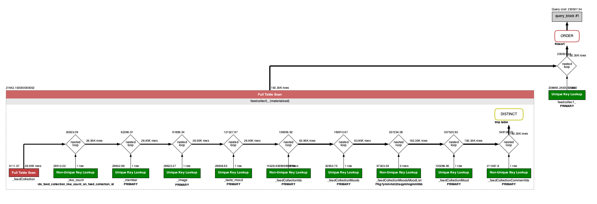

# Query Performance Comparison

## 상황 및 문제

* 로그인 상태에서 전체 피드 컬렉션을 조회를 해야 한다.
* 각 컬렉션의 무드를 함께 가져와야 한다.
* 각 컬렉션의 무드는 여러개 있을 수 있는 상황이다.
* 로그인 된 유저가 이 컬렉션을 좋아요 눌음 여부도 함께 가져와야 한다.
* 컬렉션은 페이지 적용한다.

## 해결방법

### 방법1: 전체 피드 컬렉션을 모두 조회 후 각 컬렉션의 무드를 가져온다.

#### 예시&#x20;

* JPA의 Subselect 사용

```java
@Getter  
@NoArgsConstructor(access = AccessLevel.PROTECTED)  
@Entity  
@Immutable  
@Subselect("select DISTINCT _feedCollection.id as id " +  
        ", _feedCollection.author_id as author_id " +  
        ", _member.nickname as author_nickname " +  
        ", _taste_mood.name as author_mood " +  
        ", _image.url as author_thumbnail_url " +  
        ", _feedCollection.title as title " +  
        ", _feedCollection.description as description " +  
        ", _like_count.count as like_count " +  
        ", _feedCollection.follower_count as follower_count " +  
        ", _feedCollection.thumbnail_url as thumbnail_url " +  
        ", _feedCollection.is_private as is_private " +  
        ", (select count(id) from feed_collection_feed_ids where feed_collection_feed_ids.id = _feedCollection.id ) as feed_count " +  
        ", (select count(id) from feed_collection_comment_ids where _feedCollectionCommentIds.comment_id = _feedCollection.id) as comment_count " +  
        ", false as liked " +  
        ", _feedCollection.moods_id as moods_id " +  
        ", _feedCollection.created_at as created_at " +  
        ", _feedCollection.updated_at as updated_at " +  
        "FROM feed_collection _feedCollection " +  
        "JOIN member _member on _feedCollection.author_id = _member.id " +  
        "JOIN image _image on _member.profile_image_id = _image.id " +  
        "JOIN taste_mood _taste_mood on _member.taste_mood_id = _taste_mood.id " +  
        "LEFT JOIN feed_collection_like_count _like_count on _feedCollection.id = _like_count.feed_collection_id " +  
        "LEFT JOIN feed_collection_feed_ids as _feedCollecitonIds on _feedCollection.id = _feedCollecitonIds.feed_id " +  
        "LEFT JOIN feed_collection_comment_ids as _feedCollectionCommentIds on _feedCollection.id = _feedCollectionCommentIds.comment_id "  
)  
@Table(name = "feed_collection")  
public class FeedCollectionSample {  
  
    @Id  
    private FeedCollectionId id;  
    @AttributeOverride(name = "value", column = @Column(name = "author_id"))  
    private MemberId authorId;  
    private String authorNickname;  
    private String authorMood;  
    private String authorThumbnailUrl;  
    private String title;  
    private String description;  
    private int likeCount;  
    private int followerCount;  
    private String thumbnailUrl;  
    private boolean isPrivate;  
    private int feedCount;  
    private int commentCount;  
    @OneToOne(fetch = FetchType.EAGER)  
    @JoinColumn(name = "moods_id")  
    private FeedCollectionMoods moods;  
    private LocalDateTime createdAt;  
    private LocalDateTime updatedAt;  
}
```

```java
@EntityGraph(attributePaths = {"moods"})  
@Override  
Page<FeedCollectionSample> findAll(Pageable pageable);
```

* 결과
  * page.size() 만큼 Query가 더 발생한다

<pre class="language-sql"><code class="lang-sql">select
        feedcollec0_.id as id1_0_,
        feedcollec0_.author_id as author_i2_0_,
        feedcollec0_.author_mood as author_m3_0_,
        feedcollec0_.author_nickname as author_n4_0_,
        feedcollec0_.author_thumbnail_url as author_t5_0_,
        feedcollec0_.comment_count as comment_6_0_,
        feedcollec0_.created_at as created_7_0_,
        feedcollec0_.description as descript8_0_,
        feedcollec0_.feed_count as feed_cou9_0_,
        feedcollec0_.follower_count as followe10_0_,
        feedcollec0_.is_private as is_priv11_0_,
        feedcollec0_.like_count as like_co12_0_,
        feedcollec0_.moods_id as moods_i16_0_,
        feedcollec0_.thumbnail_url as thumbna13_0_,
        feedcollec0_.title as title14_0_,
        feedcollec0_.updated_at as updated15_0_ 
    from
        ( select
            DISTINCT _feedCollection.id as id ,
            _feedCollection.author_id as author_id ,
            _member.nickname as author_nickname ,
            _taste_mood.name as author_mood ,
            _image.url as author_thumbnail_url ,
            _feedCollection.title as title ,
            _feedCollection.description as description ,
            _like_count.count as like_count ,
            _feedCollection.follower_count as follower_count ,
            _feedCollection.thumbnail_url as thumbnail_url ,
            _feedCollection.is_private as is_private ,
            (select
                count(id) 
            from
                feed_collection_feed_ids 
            where
                feed_collection_feed_ids.id = _feedCollection.id ) as feed_count ,
            (select
                count(id) 
            from
                feed_collection_comment_ids 
            where
                _feedCollectionCommentIds.comment_id = _feedCollection.id) as comment_count ,
            false as liked ,
            _feedCollection.moods_id as moods_id ,
            _feedCollection.created_at as created_at ,
            _feedCollection.updated_at as updated_at 
        FROM
            feed_collection _feedCollection 
        JOIN
            member _member 
                on _feedCollection.author_id = _member.id 
        JOIN
            image _image 
                on _member.profile_image_id = _image.id 
        JOIN
            taste_mood _taste_mood 
                on _member.taste_mood_id = _taste_mood.id 
        LEFT JOIN
            feed_collection_like_count _like_count 
                on _feedCollection.id = _like_count.feed_collection_id 
        LEFT JOIN
            feed_collection_feed_ids as _feedCollecitonIds 
                on _feedCollection.id = _feedCollecitonIds.feed_id 
        LEFT JOIN
            feed_collection_comment_ids as _feedCollectionCommentIds 
                on _feedCollection.id = _feedCollectionCommentIds.comment_id  
            ) feedcollec0_ 
    order by
        feedcollec0_.created_at desc limit ?
Hibernate: 
    select
        feedcollec0_.id as id1_17_0_,
        feedcollec0_.created_at as created_2_17_0_,
        feedcollec0_.updated_at as updated_3_17_0_,
        moodlist1_.feed_collection_moods_id as feed_col1_18_1_,
        feedcollec2_.id as mood_lis2_18_1_,
        feedcollec2_.id as id1_16_2_,
        feedcollec2_.created_at as created_2_16_2_,
        feedcollec2_.name as name3_16_2_,
        feedcollec2_.updated_at as updated_4_16_2_ 
    from
        feed_collection_moods feedcollec0_ 
    left outer join
        feed_collection_moods_mood_list moodlist1_ 
            on feedcollec0_.id=moodlist1_.feed_collection_moods_id 
    left outer join
        feed_collection_mood feedcollec2_ 
            on moodlist1_.mood_list_id=feedcollec2_.id 
    where
        feedcollec0_.id=?
<strong>
</strong><strong>..............
</strong><strong>
</strong>Hibernate: 
    select
        feedcollec0_.id as id1_17_0_,
        feedcollec0_.created_at as created_2_17_0_,
        feedcollec0_.updated_at as updated_3_17_0_,
        moodlist1_.feed_collection_moods_id as feed_col1_18_1_,
        feedcollec2_.id as mood_lis2_18_1_,
        feedcollec2_.id as id1_16_2_,
        feedcollec2_.created_at as created_2_16_2_,
        feedcollec2_.name as name3_16_2_,
        feedcollec2_.updated_at as updated_4_16_2_ 
    from
        feed_collection_moods feedcollec0_ 
    left outer join
        feed_collection_moods_mood_list moodlist1_ 
            on feedcollec0_.id=moodlist1_.feed_collection_moods_id 
    left outer join
        feed_collection_mood feedcollec2_ 
            on moodlist1_.mood_list_id=feedcollec2_.id 
    where
        feedcollec0_.id=?
</code></pre>

### 방법2: 하나의 쿼리로 모든 데이터를 가져온 다음 비지니스 로직에서 grouping하고 translate한다.

#### 예시&#x20;

**QueryDSL**

```java
@Override  
public Slice<FeedCollectionSummary> findAllSummary(MemberId memberId, Pageable pageable) {  
    Expression<Boolean> liked = getLiked(memberId);  
    return getSliceOfAllCollectionSummaries(pageable, liked);  
}  
  
private Slice<FeedCollectionSummary> getSliceOfAllCollectionSummaries(  
        Pageable pageable, Expression<Boolean> liked  
) {  
    // table  
    QFeedCollection feedCollection = QFeedCollection.feedCollection;  
    QMember member = QMember.member;  
    QImage image = QImage.image;  
    QTasteMood tasteMood = QTasteMood.tasteMood;  
    QFeedCollectionLikeCount likeCount = QFeedCollectionLikeCount.feedCollectionLikeCount;  
    QFeedCollectionMood mood = QFeedCollectionMood.feedCollectionMood;  
  
    // query  
    JPAQuery<?> query = queryFactory  
            .from(feedCollection)  
            .join(member).on(feedCollection.authorId.eq(member.id))  
            .join(image).on(member.profileImage.id.eq(image.id))  
            .join(tasteMood).on(member.tasteMood.eq(tasteMood))  
            .join(likeCount).on(feedCollection.id.eq(likeCount.feedCollectionId))  
            .join(mood).on(mood.in(feedCollection.moods.moodList))  
            .offset(pageable.getOffset())  
            .limit(pageable.getPageSize() + 1L);  
  
    // sort  
    for (Sort.Order order : pageable.getSort()) {  
        SimplePath<Comparable<?>> compare = Expressions.path(  
                order.getProperty().getClass(), feedCollection, order.getProperty());  
        OrderSpecifier<?> orderSpecifier = new OrderSpecifier<>(  
                order.isAscending() ? Order.ASC : Order.DESC, compare);  
        query.orderBy(orderSpecifier);  
    }  
  
    // transform  
    List<FeedCollectionSummary> allCollectionSummaries = query.transform(  
            GroupBy.groupBy(feedCollection.id)  
                    .list(Projections.constructor(  
                            FeedCollectionSummary.class,  
                            feedCollection.id,  
                            feedCollection.thumbnailUrl,  
                            member.id,  
                            member.nickname,  
                            tasteMood.name,  
                            image.url,  
                            feedCollection.title,  
                            feedCollection.description,  
                            likeCount.count,  
                            feedCollection.followerCount,  
                            feedCollection.feedIds.ids.size(),  
                            feedCollection.commentIds.ids.size(),  
                            liked,  
                            GroupBy.list(mood.name),  
                            feedCollection.createdAt,  
                            feedCollection.updatedAt  
                    )));  
  
    // slice  
    boolean hasNext = allCollectionSummaries.size() > pageable.getPageSize();  
    if (hasNext) {  
        allCollectionSummaries.remove(allCollectionSummaries.size() - 1);  
    }  
    return new SliceImpl<>(allCollectionSummaries, pageable, hasNext);  
}  
  
private static Expression<Boolean> getLiked(MemberId memberId) {  
    QFeedCollectionLike feedCollectionLike = QFeedCollectionLike.feedCollectionLike;  
    return JPAExpressions  
            .selectOne()  
            .from(feedCollectionLike)  
            .where(isLikedCollection(memberId))  
            .exists();  
}  
  
private static BooleanExpression isLikedCollection(MemberId memberId) {  
    QFeedCollection feedCollection = QFeedCollection.feedCollection;  
    QFeedCollectionLike feedCollectionLike = QFeedCollectionLike.feedCollectionLike;  
    return feedCollectionLike.memberId.eq(memberId)  
            .and(feedCollectionLike.feedCollectionId.eq(feedCollection.id));  
}
```

**결과**

```sql
select
        feedcollec0_.id as col_0_0_,
        feedcollec0_.id as col_1_0_,
        feedcollec0_.thumbnail_url as col_2_0_,
        member1_.id as col_3_0_,
        member1_.nickname as col_4_0_,
        tastemood3_.name as col_5_0_,
        image2_.url as col_6_0_,
        feedcollec0_.title as col_7_0_,
        feedcollec0_.description as col_8_0_,
        feedcollec4_.count as col_9_0_,
        feedcollec0_.follower_count as col_10_0_,
        (select
            count(ids9_.feed_id) 
        from
            feed_collection_feed_ids ids9_ 
        where
            feedcollec0_.id = ids9_.feed_id) as col_11_0_,
        (select
            count(ids10_.comment_id) 
        from
            feed_collection_comment_ids ids10_ 
        where
            feedcollec0_.id = ids10_.comment_id) as col_12_0_,
        exists (select
            1 
        from
            feed_collection_like feedcollec8_ 
        where
            feedcollec8_.member_id=? 
            and feedcollec8_.feed_collection_id=feedcollec0_.id) as col_13_0_,
        feedcollec5_.name as col_14_0_,
        feedcollec0_.created_at as col_15_0_,
        feedcollec0_.updated_at as col_16_0_ 
    from
        feed_collection feedcollec0_ 
    inner join
        member member1_ 
            on (
                feedcollec0_.author_id=member1_.id
            ) 
    inner join
        image image2_ 
            on (
                member1_.profile_image_id=image2_.id
            ) 
    inner join
        taste_mood tastemood3_ 
            on (
                member1_.taste_mood_id=tastemood3_.id
            ) 
    inner join
        feed_collection_like_count feedcollec4_ 
            on (
                feedcollec0_.id=feedcollec4_.feed_collection_id
            ) 
    inner join
        feed_collection_moods feedcollec6_ 
            on feedcollec0_.moods_id=feedcollec6_.id 
    inner join
        feed_collection_mood feedcollec5_ 
            on (
                feedcollec5_.id in (
                    select
                        moodlist7_.mood_list_id 
                from
                    feed_collection_moods_mood_list moodlist7_ 
                where
                    feedcollec6_.id=moodlist7_.feed_collection_moods_id
            )
        ) 
    order by
        feedcollec0_.created_at desc limit ?
```

## 의문?

무조건 하나의 쿼리로 모든 값을 가져오는 것 이 더 빠르고 좋은 방법일까?

## 테스트

### 조건

* 컬렉션 1,000,000건
* 컬렉션 무드 1,000,000건
* 이미지 1,000,000건
* 멤버 1,000,000건
* 피드 1,000,000건
* 피드 무드 1,000,000건
* 피드 좋아요 카운트 1,000,000건

## 문제 1

* 조회시 시간이 많이 걸린다
* Explain으로 분석

<figure><figcaption></figcaption></figure>

<figure><figcaption></figcaption></figure>

* DB 로그 확인 한 실제 쿼리

```sql
select
        feedcollec0_.id as col_0_0_,
        feedcollec0_.id as col_1_0_,
        feedcollec0_.thumbnail_url as col_2_0_,
        member1_.id as col_3_0_,
        member1_.nickname as col_4_0_,
        tastemood3_.name as col_5_0_,
        image2_.url as col_6_0_,
        feedcollec0_.title as col_7_0_,
        feedcollec0_.description as col_8_0_,
        feedcollec4_.count as col_9_0_,
        feedcollec0_.follower_count as col_10_0_,
        (select
            count(ids9_.feed_id) 
        from
            feed_collection_feed_ids ids9_ 
        where
            feedcollec0_.id = ids9_.feed_collection_id) as col_11_0_,
        (select
            count(ids10_.comment_id) 
        from
            feed_collection_comment_ids ids10_ 
        where
            feedcollec0_.id = ids10_.feed_collection_id) as col_12_0_,
        exists (select
            1 
        from
            feed_collection_like feedcollec8_ 
        where
            feedcollec8_.member_id=? 
            and feedcollec8_.feed_collection_id=feedcollec0_.id) as col_13_0_,
        feedcollec5_.name as col_14_0_,
        feedcollec0_.created_at as col_15_0_,
        feedcollec0_.updated_at as col_16_0_ 
    from
        feed_collection feedcollec0_ 
    inner join
        member member1_ 
            on (
                feedcollec0_.author_id=member1_.id
            ) 
    inner join
        image image2_ 
            on (
                member1_.profile_image_id=image2_.id
            ) 
    inner join
        taste_mood tastemood3_ 
            on (
                member1_.taste_mood_id=tastemood3_.id
            ) 
    inner join
        feed_collection_like_count feedcollec4_ 
            on (
                feedcollec0_.id=feedcollec4_.feed_collection_id
            ) 
    inner join
        feed_collection_moods feedcollec6_ 
            on feedcollec0_.moods_id=feedcollec6_.id 
    inner join
        feed_collection_mood feedcollec5_ 
            on (
                feedcollec5_.id in (
                    select
                        moodlist7_.mood_list_id 
                from
                    feed_collection_moods_mood_list moodlist7_ 
                where
                    feedcollec6_.id=moodlist7_.feed_collection_moods_id
            )
        ) 
    order by
        feedcollec0_.created_at desc limit ?
```

### 해결방법

index 추가를 하여 조회 성능 향상

## index 추가 검토

### FeedCollection 정렬 Query

```sql
order by feedcollec0_.created_at desc 
```

<mark style="color:orange;">**index 확인**</mark>

```sql
-- feed_collection 테이블의 인덱스 확인
SHOW INDEXES FROM feed_collection;
```

<mark style="color:green;">**결과!!**</mark>

<figure><figcaption></figcaption></figure>

* FeedCollection의 `created_at` 컬럼에 index 존재 하지 않음

<mark style="color:purple;">**해결**</mark>

* `feed_collection` 테이블: `created_at` 컬럼에 index 추가

```sql
CREATE INDEX idx_feed_collection_created_at ON feed_collection (created_at DESC);
```

### Member 테이블 조인

```sql
inner join member member1_ on (feedcollec0_.author_id = member1_.id)
```

<mark style="color:orange;">**index 확인**</mark>

```sql
-- member 테이블의 인덱스 확인 
SHOW INDEXES FROM member;
```

<mark style="color:green;">**결과**</mark>&#x20;

<figure><figcaption></figcaption></figure>

Member.id가 Primary Key이므로 index 존재한다.

### Image 테이블 조인

```sql
inner join image image2_ on (member1_.profile_image_id = image2_.id)
```

<mark style="color:orange;">**index 확인**</mark>

```sql
-- image 테이블의 인덱스 확인 
SHOW INDEXES FROM image;
```

<mark style="color:green;">**결과**</mark>&#x20;

<figure><figcaption></figcaption></figure>

Image.id도 Primary Key이므로 index 존재한다.

### TasteMood 테이블 조인

```sql
inner join taste_mood tastemood3_ on (member1_.taste_mood_id = tastemood3_.id) 
```

<mark style="color:orange;">**index 확인**</mark>

```sql
-- taste_mood 테이블의 인덱스 확인 
SHOW INDEXES FROM taste_mood;
```

<mark style="color:green;">**결과**</mark>&#x20;

<figure><figcaption></figcaption></figure>

TasteMood.id도 Primary Key이므로 index 존재한다.

### FeedCollectionLikeCount 테이블 조인

```sql
inner join feed_collection_like_count feedcollec4_ on (feedcollec0_.id = feedcollec4_.feed_collection_id)
```

<mark style="color:orange;">**index 확인**</mark>

```sql
-- feed_collection_like_count 테이블의 인덱스 확인 
SHOW INDEXES FROM feed_collection_like_count;
```

<mark style="color:green;">**결과**</mark> <mark style="color:green;"></mark><mark style="color:green;">!!</mark>

<figure><figcaption></figcaption></figure>

`feed_collection_like_count` 테이블의 `feed_collection_id` 컬럼에 index가 존재하지 않음&#x20;

<mark style="color:purple;">**해결**</mark>

`feed_collection_id` 컬럼에 index 추가

```sql
CREATE INDEX idx_feed_collection_like_count_on_feed_collection_id ON feed_collection_like_count (feed_collection_id);
```

### FeedCollectionMoods 테이블 조인

```sql
inner join feed_collection_moods feedcollec6_ on feedcollec0_.moods_id = feedcollec6_.id 
```

<mark style="color:orange;">**index 확인**</mark>

```
SHOW INDEXES FROM feed_collection_moods;
```

<mark style="color:green;">**결과**</mark>&#x20;

<figure><figcaption></figcaption></figure>

FeedCollectionMoods.id 도 primary key이므로 index가 존재한다

### FeedCollectionMoodsMoodList 테이블 조인

```sql
select moodlist7_.mood_list_id  
from feed_collection_moods_mood_list moodlist7_  
where feed_collection_moods.id = moodlist7_.feed_collection_moods_id
```

<mark style="color:orange;">**index 확인**</mark>

```sql
SHOW INDEXES FROM feed_collection_moods_mood_list;
```

<mark style="color:green;">**결과**</mark>&#x20;

<figure><figcaption></figcaption></figure>

FeedCollectionMoodsMoodList.mood\_list\_id와 feeed\_collection\_moods\_id에 대한 index가 존재한다

### FeedCollectionMood 테이블 조인

```sql
inner join feed_collection_mood feedcollec5_ on  
    (feedcollec5_.id in 
	    (select moodlist7_.mood_list_id                       
	     from feed_collection_moods_mood_list moodlist7_  
		 where feedcollec6_.id = moodlist7_.feed_collection_moods_id)
     )
```

<mark style="color:orange;">**index 확인**</mark>

```sql
SHOW INDEXES FROM feed_collection_mood;
```

<mark style="color:green;">**결과**</mark>&#x20;

<figure><figcaption></figcaption></figure>

FeedCollectionMood.id 가 primary key이므로 index가 존재한다

### FeedCollectionFeedIds 테이블 서브 쿼리

```sql
select count(ids9_.feed_collection_id) 
from feed_collection_feed_ids ids9_ 
where feedcollec0_.id = ids9_.feed_collection_id
```

<mark style="color:orange;">**index 확인**</mark>

```sql
-- feed_collection_feed_ids 테이블에서 feed_id 컬럼의 인덱스 확인 
SHOW INDEXES FROM feed_collection_feed_ids;
```

<mark style="color:green;">**결과**</mark>&#x20;

<figure><figcaption></figcaption></figure>

feed\_collection\_id가 index가 존재한다

### FeedCollectionCommentIds 테이블 서버 쿼리

```sql
select count(ids10_.comment_id)  
from feed_collection_comment_ids ids10_  
where feedcollec0_.id = ids10_.comment_id
```

<mark style="color:orange;">**index 확인**</mark>

```sql
-- feed_collection_comment_ids 테이블에서 comment_id 컬럼의 인덱스 확인 
SHOW INDEXES FROM feed_collection_comment_ids;
```

<mark style="color:green;">**결과**</mark>&#x20;

<figure><figcaption></figcaption></figure>

comment\_id가 index가 존재한다

### FeedCollectionLike 테이블 서버 쿼리

```sql
select 1  
from feed_collection_like feedcollec8_  
where feedcollec8_.member_id = '1'  
 and feedcollec8_.feed_collection_id = feedcollec0_.id
```

<mark style="color:orange;">**index 확인**</mark>

```sql
-- feed_collection_like 테이블의 인덱스 확인
SHOW INDEXES FROM feed_collection_like;
```

<mark style="color:green;">**결과**</mark> <mark style="color:green;"></mark><mark style="color:green;">!!</mark>

<figure><figcaption></figcaption></figure>

`feed_collection_like` 테이블의 `member_id`,`feed_collection_id` 컬럼에 index 가 없음 해결 `feed_collection_like` 테이블: `member_id`,`feed_collection_id` 컬럼에 index 추가

<mark style="color:purple;">**해결**</mark>

<figure><figcaption></figcaption></figure>

<figure><figcaption></figcaption></figure>

더미 데이터에서는 feed\_collection\_id의 **cardinality** 가 더 높아서 feed\_collection\_id를 first Index로 하는 것이 유리 하다

```sql
CREATE INDEX idx_feed_collection_like_on_member_id_and_feed_collection_id 
ON feed_collection_like (feed_collection_id,member_id);
```

## index 추가 후(Explain)

<figure><figcaption></figcaption></figure>

* _MySQl Workbench Visual Explain오류가 있음_

<figure><figcaption></figcaption></figure>

## 문제 2

### 기존 Subselect 조회가 안됨(시간이 너무 오래 걸림...)

* 방법1: 전체 피드 컬렉션을 모두 조회 후 각 컬렉션의 무드를 가져온다.


```sql
select feedcollec0_.id                   as id1_0_0_,  
       feedcollec1_.id                   as id1_17_1_,  
       feedcollec0_.author_id            as author_i2_0_0_,  
       feedcollec0_.author_mood          as author_m3_0_0_,  
       feedcollec0_.author_nickname      as author_n4_0_0_,  
       feedcollec0_.author_thumbnail_url as author_t5_0_0_,  
       feedcollec0_.comment_count        as comment_6_0_0_,  
       feedcollec0_.created_at           as created_7_0_0_,  
       feedcollec0_.description          as descript8_0_0_,  
       feedcollec0_.feed_count           as feed_cou9_0_0_,  
       feedcollec0_.follower_count       as followe10_0_0_,  
       feedcollec0_.is_private           as is_priv11_0_0_,  
       feedcollec0_.like_count           as like_co12_0_0_,  
       feedcollec0_.moods_id             as moods_i16_0_0_,  
       feedcollec0_.thumbnail_url        as thumbna13_0_0_,  
       feedcollec0_.title                as title14_0_0_,  
       feedcollec0_.updated_at           as updated15_0_0_,  
       feedcollec1_.created_at           as created_2_17_1_,  
       feedcollec1_.updated_at           as updated_3_17_1_  
from (select DISTINCT _feedCollection.id                                                
                        as id,  
                      _feedCollection.author_id                                         
                        as author_id,  
                      _member.nickname                                                  
                        as author_nickname,  
                      _taste_mood.name                                                  
                        as author_mood,  
                      _image.url                                                        
                        as author_thumbnail_url,  
                      _feedCollection.title                                             
                        as title,  
                      _feedCollection.description                                       
                        as description,  
                      _like_count.count                                                 
                        as like_count,  
                      _feedCollection.follower_count                                    
                        as follower_count,  
                      _feedCollection.thumbnail_url                                     
                        as thumbnail_url,  
                      _feedCollection.is_private                                        
                        as is_private,  
                      (select count(id)  
                       from feed_collection_feed_ids  
                       where feed_collection_feed_ids.id = _feedCollection.id)          
                         as feed_count,  
                      (select count(id)  
                       from feed_collection_comment_ids  
                       where _feedCollectionCommentIds.comment_id = _feedCollection.id) 
                         as comment_count,  
                      exists (select 1  
                             from feed_collection_like feedcollec5_  
                             where feedcollec5_.member_id = '2'  
                             and feedcollec5_.feed_collection_id = feedcollec0_.id)     
                        as liked,  
                      _feedCollection.moods_id                                          
                        as moods_id,  
                      _feedCollection.created_at                                        
                        as created_at,  
                      _feedCollection.updated_at                                        
                        as updated_at  
      FROM feed_collection _feedCollection  
        JOIN member _member 
               on _feedCollection.author_id = _member.id  
        LEFT JOIN image _image 
               on _member.profile_image_id = _image.id  
        JOIN taste_mood _taste_mood 
               on _member.taste_mood_id = _taste_mood.id  
        LEFT JOIN feed_collection_like_count _like_count 
               on _feedCollection.id = _like_count.feed_collection_id  
        LEFT JOIN feed_collection_feed_ids as _feedCollecitonIds  
               on _feedCollection.id = _feedCollecitonIds.feed_id  
        LEFT JOIN feed_collection_moods as _feedCollectionMoods 
               on _feedCollection.id = _feedCollectionMoods.id  
        LEFT JOIN feed_collection_moods_mood_list as _feedCollectionMoodsMoodList  
               on _feedCollectionMoods.id = _feedCollectionMoodsMoodList.feed_collection_moods_id  
        LEFT JOIN feed_collection_mood as _feedCollectionMood  
               on _feedCollectionMoodsMoodList.mood_list_id = _feedCollectionMood.id  
        LEFT JOIN feed_collection_comment_ids as _feedCollectionCommentIds  
               on _feedCollection.id = _feedCollectionCommentIds.comment_id
 ) as feedcollec0_  
left outer join feed_collection_moods feedcollec1_ 
       on feedcollec0_.moods_id = feedcollec1_.id  
order by feedcollec0_.created_at desc  
limit 21;
```

#### 분석

<figure><figcaption></figcaption></figure>

<figure><figcaption></figcaption></figure>

* **페이징**이 **풀스캔** 조회 후 적용되기 때문에 속도가 매우 늦음

### 해결방법

개선한 Query

* subSelect를 사용하지 않고 PrimarySelect를 사용해서 데이터를 가져온 다음 **feedcollectionId**로 **Mood**를 가져온다

```sql
select feedcollec0_.id                                                  as col_0_0_,
       feedcollec0_.id                                                  as col_1_0_,
       feedcollec0_.thumbnail_url                                       as col_2_0_,
       member1_.id                                                      as col_3_0_,
       member1_.nickname                                                as col_4_0_,
       tastemood3_.name                                                 as col_5_0_,
       image2_.url                                                      as col_6_0_,
       feedcollec0_.title                                               as col_7_0_,
       feedcollec0_.description                                         as col_8_0_,
       feedcollec4_.count                                               as col_9_0_,
       feedcollec0_.follower_count                                      as col_10_0_,
       (select count(ids6_.feed_collection_id)
        from feed_collection_feed_ids ids6_
        where feedcollec0_.id = ids6_.feed_collection_id)               as col_11_0_,
       (select count(ids7_.feed_collection_id)
        from feed_collection_comment_ids ids7_
        where feedcollec0_.id = ids7_.feed_collection_id)               as col_12_0_,
       exists (select 1
               from feed_collection_like feedcollec5_
               where feedcollec5_.member_id = '2'
                 and feedcollec5_.feed_collection_id = feedcollec0_.id) as col_13_0_,
       feedcollec0_.created_at                                          as col_14_0_,
       feedcollec0_.updated_at                                          as col_15_0_
from feed_collection feedcollec0_
         inner join member member1_ on (feedcollec0_.author_id = member1_.id)
         inner join image image2_ on (member1_.profile_image_id = image2_.id)
         inner join taste_mood tastemood3_ on (member1_.taste_mood_id = tastemood3_.id)
         inner join feed_collection_like_count feedcollec4_ on (feedcollec0_.id = feedcollec4_.feed_collection_id)
order by feedcollec0_.created_at desc
limit 21;
```

<figure><figcaption></figcaption></figure>

<figure><figcaption></figcaption></figure>

* Page.size() 만큼 무드 가져온다

```sql
select feedcollec3_.name as col_0_0_  
from feed_collection_moods feedcollec0_  
         inner join feed_collection_moods_mood_list moodlist1_ on feedcollec0_.id = moodlist1_.feed_collection_moods_id  
         inner join feed_collection_mood feedcollec2_ on moodlist1_.mood_list_id = feedcollec2_.id  
         inner join feed_collection_mood feedcollec3_ on (feedcollec2_.id = feedcollec3_.id)  
where feedcollec0_.id = 'bc0bbe26f1d4b5eb1cc830c6';
```

## 성능 비교

### 방법1: 전체 피드 컬렉션을 모두 조회 후 각 컬렉션의 무드를 가져온다.

#### 실행시간

1. `1.164984917`
2. `0.972829875`
3. `0.428266`
4. `0.29384225`
5. `0.290687333`
6. `0.70399425`
7. `0.494678959`
8. `0.266329875`
9. `0.281143`
10. `0.662992458`

### 방법2: 하나의 쿼리로 모든 데이터를 가져온 다음 비지니스 로직에서 grouping하고 translate한다.

#### 실행시간

1. `1.039670875`
2. `1.119028917`
3. `1.12612275`
4. `0.356143041`
5. `0.339214875`
6. `0.213284958`
7. `0.422505167`
8. `0.435642875`
9. `0.247029625`
10. `0.1757515`


처음 조회 시 속도가 늦고, 이후 조회에서 점점 빨라지는 현상은 데이터베이스의 캐싱 메커니즘 때문일 가능성이 높다.

키워드

* **버퍼 풀 (InnoDB Buffer Pool)**
* **OS 캐시**
* **쿼리 실행 계획 캐시**
* **커넥션 풀**
* **애플리케이션 레벨 캐시**
* **하드웨어 캐시**
* **데이터베이스 세션 상태**


## 결론

### 대량 데이터를 조회시 index 설계는 반드시 고려해야 할 사항이다

### 함부로 subselect를 사용하면 안된다

### 단일 쿼리로 모든 데이터를 가져오는 것과 제한된 여러 쿼리로 데이터를 나눠서 가져오는 것 사이에는 속도 면에서 큰 차이는 없다
