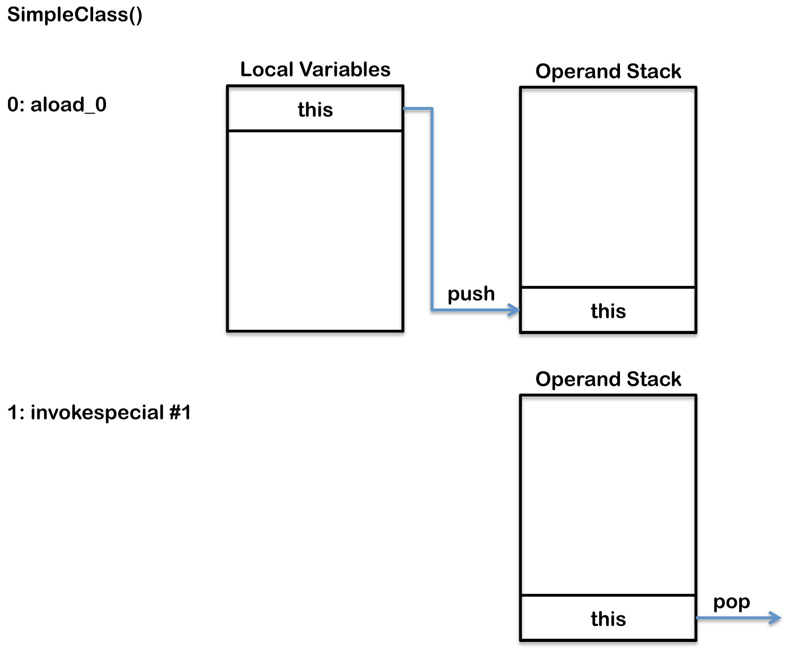

# Shared Between Threads

## Heap

Heap은 런타임에 클래스 인스턴스와 배열을 할당하는 데 사용됩니다. Frame은 생성된 후 크기가 변경되도록 설계되지 않았기 때문에 배열과 객체는 stack에 저장할 수 없습니다. 프레임은 heap의 객체 또는 배열을 가리키는 참조만 저장합니다. 로컬 변수 배열(각 frame에서)의 기본 변수 및 참조와 달리 객체는 항상 힙에 저장되므로 메서드가 종료될 때 제거되지 않습니다. 대신 객체는 garbage collector에 의해서만 제거됩니다.


garbage collection을 지원하기 위해 힙은 세 부분으로 나뉩니다.

* Young Generation
  * 종종 Eden과 Survivor로 나뉩니다.
* Old Generation
  * Tenured Generation이라고도 함
* Permanent Generation

## Memory Management

객체 및 배열은 garbage collector가 자동으로 회수하는 대신 명시적으로 할당 해제되지 않습니다.


일반적으로 다음과 같이 작동합니다.

1. 새로운 객체와 배열이 young generation에 생성됩니다.
2. Minor garbage collection은 young generation에서 작동합니다. 아직 살아있는 겍체는 eden 공간에서 survivor 공간으로 이동됩니다.
3. 일반적으로 애플리케이션 thread를 일시 중지시키는 Major garbage collection은 세대 간에 객체를 이동합니다. 아직 살아있는 객체는 young generation에서 old(tenured) generation로 이동됩니다.
4. Permanent generation는 old generation가 수집될 때마다 수집됩니다. 둘 중 하나가 가득 차면 둘 다 수집됩니다.

## Non-Heap Memory

논리적으로 JVM 메커니즘의 일부로 간주되는 객체는 Heap에 생성되지 않습니다.


non-heap 메모리에는 다음이 포함됩니다.

* Permanent Generation
  * the method area
  * interned strings
* Code Cache
  * JIT 컴파일러에 의해 native 코드로 컴파일된 메서드의 컴파일 및 저장에 사용

## Just In Time (JIT) Compliation

Java 바이트 코드는 해석되지만 JVM의 호스트 CPU에서 native 코드를 직접 실행하는 것만큼 빠르지는 않습니다. 성능을 향상시키기 위해 Oracle Hotspot VM은 정기적으로 실행되는 바이트 코드의 "핫" 영역을 찾고 이를 네이티브 코드로 컴파일합니다. Native code는 heap이 아닌 메모리의 코드 캐시에 저장됩니다. 이러한 방식으로 Hotspot VM은 코드를 컴파일하는 데 걸리는 추가 시간과 해석된 코드를 실행하는 데 걸리는 추가 시간을 절충하는 가장 적절한 방법을 선택하려고 합니다.&#x20;

## Method Area

메소드 영역은 다음과 같은 클래스별 정보를 저장합니다.

* Classloader Reference
* Run Time Constant Poll
  * Numertic constants
  * Field references
  * Method References
  * Attributes
* Field data
  * Per filed
    * Name
    * Type
    * Modifiers
    * Attributes
* Method data
  * Per method
    * Name
    * Return Type
    * Parameter Types (in order)
    * Modifiers
    * Attributes
* Method code
  * Per method
    * Bytecodes
    * Operand stack size
    * Local variable size
    * Local variable table
    * Exception table
      * Per exception handler
        * Start point
        * End point
        * PC offset for handler code
        * Constant pool index for exception class being caught


모든 스레드는 동일한 메서드 영역을 공유하므로 메서드 영역 데이터에 대한 액세스와 동적 연결 프로세스는 thread safe해야 합니다. 두 스레드가 아직 로드되지 않은 클래스의 필드나 메서드에 액세스하려고 시도하는 경우 한 번만 로드해야 하며 두 스레드 모두 로드될 때까지 실행을 계속해서는 안 됩니다.

## Class File Structure

컴파일된 클래스 파일은 다음 구조로 구성됩니다.

```java
ClassFile {
    u4			magic;
    u2			minor_version;
    u2			major_version;
    u2			constant_pool_count;
    cp_info		contant_pool[constant_pool_count – 1];
    u2			access_flags;
    u2			this_class;
    u2			super_class;
    u2			interfaces_count;
    u2			interfaces[interfaces_count];
    u2			fields_count;
    field_info		fields[fields_count];
    u2			methods_count;
    method_info		methods[methods_count];
    u2			attributes_count;
    attribute_info	attributes[attributes_count];
}
```

| component                             | description                                                                                          |
| ------------------------------------- | ---------------------------------------------------------------------------------------------------- |
| magic, minor\_version, major\_version | magic, minor\_version, major\_version은 클래스 버전 및 이 클래스가 컴파일된 JDK 버전에 대한 정보를 지정합니다.                    |
| constant\_pool                        | Symbol  테이블과 유사하지만 더 많은 데이터를 포함하고 있다 . 이에 대해서는 아래에서 자세히 설명합니다.                                      |
| access\_flags                         | 이 클래스에 대한 수정자 list를 제공합니다.                                                                           |
| this\_class                           | 이 클래스의 정규화된 이름(예: org/jamesdbloom/foo/Bar)을 제공하는 constant\_pool에 대한 인덱스                              |
| super\_class                          | 상위 클래스 (즉, java/lang/Object)에 대한 symbolic 참조를 제공하는 constant\_pool에 대한 인덱스                            |
| interfaces                            | 구현된 모든 인터페이스에 대한 symbolic 참조를 제공하는 constant\_pool에 대한 인덱스 배열.                                        |
| fields                                | 각 필드에 대한 완전한 설명을 제공하는 constant\_pool에 대한 인덱스 배열.                                                     |
| methods                               | 각 메서드 시그니처에 대한 완전한 설명을 제공하는 constant\_pool에 대한 인덱스 배열, 메서드가 abstract 또는 native가 아닌 경우 바이트코드도 존재합니다. |
| attributes                            | RetentionPolicy.CLASS 또는 RetentionPolicy.RUNTIME이 있는 annotaions을 포함하여 클래스에 대한 추가 정보를 제공하는 다양한 값의 배열 |

javap 명령을 사용하여 컴파일된 Java 클래스의 바이트 코드를 볼 수 있습니다.


다음과 같은 간단한 클래스를 컴파일하는 경우:

```java
package org.jvminternals;

public class SimpleClass {

    public void sayHello() {
        System.out.println("Hello");
    }

}
```

그런 다음 실행하면 다음과 같은 결과가 나타납니다


```bash
javap -v -p -s -sysinfo -constants classes/org/jvminternals/SimpleClass.class
```

```java
public class org.jvminternals.SimpleClass
  SourceFile: "SimpleClass.java"
  minor version: 0
  major version: 51
  flags: ACC_PUBLIC, ACC_SUPER
Constant pool:
   #1 = Methodref          #6.#17         //  java/lang/Object."<init>":()V
   #2 = Fieldref           #18.#19        //  java/lang/System.out:Ljava/io/PrintStream;
   #3 = String             #20            //  "Hello"
   #4 = Methodref          #21.#22        //  java/io/PrintStream.println:(Ljava/lang/String;)V
   #5 = Class              #23            //  org/jvminternals/SimpleClass
   #6 = Class              #24            //  java/lang/Object
   #7 = Utf8               <init>
   #8 = Utf8               ()V
   #9 = Utf8               Code
  #10 = Utf8               LineNumberTable
  #11 = Utf8               LocalVariableTable
  #12 = Utf8               this
  #13 = Utf8               Lorg/jvminternals/SimpleClass;
  #14 = Utf8               sayHello
  #15 = Utf8               SourceFile
  #16 = Utf8               SimpleClass.java
  #17 = NameAndType        #7:#8          //  "<init>":()V
  #18 = Class              #25            //  java/lang/System
  #19 = NameAndType        #26:#27        //  out:Ljava/io/PrintStream;
  #20 = Utf8               Hello
  #21 = Class              #28            //  java/io/PrintStream
  #22 = NameAndType        #29:#30        //  println:(Ljava/lang/String;)V
  #23 = Utf8               org/jvminternals/SimpleClass
  #24 = Utf8               java/lang/Object
  #25 = Utf8               java/lang/System
  #26 = Utf8               out
  #27 = Utf8               Ljava/io/PrintStream;
  #28 = Utf8               java/io/PrintStream
  #29 = Utf8               println
  #30 = Utf8               (Ljava/lang/String;)V
{
  public org.jvminternals.SimpleClass();
    Signature: ()V
    flags: ACC_PUBLIC
    Code:
      stack=1, locals=1, args_size=1
        0: aload_0
        1: invokespecial #1    // Method java/lang/Object."<init>":()V
        4: return
      LineNumberTable:
        line 3: 0
      LocalVariableTable:
        Start  Length  Slot  Name   Signature
          0      5      0    this   Lorg/jvminternals/SimpleClass;

  public void sayHello();
    Signature: ()V
    flags: ACC_PUBLIC
    Code:
      stack=2, locals=1, args_size=1
        0: getstatic      #2    // Field java/lang/System.out:Ljava/io/PrintStream;
        3: ldc            #3    // String "Hello"
        5: invokevirtual  #4    // Method java/io/PrintStream.println:(Ljava/lang/String;)V
        8: return
      LineNumberTable:
        line 6: 0
        line 7: 8
      LocalVariableTable:
        Start  Length  Slot  Name   Signature
          0      9      0    this   Lorg/jvminternals/SimpleClass;
}
```

이 클래스 파일은 상수 풀, 생성자 및 sayHello 메서드의 세 가지 주요 섹션을 보여줍니다.

* Constatn Pool - 이는 symbol 테이블이 일반적으로 제공하는 것과 동일한 정보를 제공하며 아래에서 자세히 설명합니다
* Methods – 각각 네 가지 영역 포함:
  * signature and access flags
  * byte code
  * LineNumberTable - 이것은 디버거에 정보를 제공하여 어떤 줄이 어떤 바이트 코드 명령어에 해당하는지 표시합니다. 예를 들어 Java 코드의 6번 줄은 sayHello 메서드의 바이트 코드 0에 해당하고 7번 줄은 바이트 코드 8에 해당합니다.
  * LocalVariableTable - 이것은 frame에 제공된 모든 지역 변수를 나열합니다. 두 예제에서 유일한 지역 변수는 this입니다.

다음 바이트 코드 피연산자는 이 클래스 파일에서 사용됩니다.

`aload_0`

* 이 opcode는 `aload_<n>`형식의 opcode 그룹 중 하나입니다. 그들은 모두 객체 참조를 피연산자 스택에 로드합니다. `<n>`은 액세스되고 있지만 0, 1, 2 또는 3만 될 수 있는 로컬 변수 배열의 위치를 ​​나타냅니다. 객체 참조 `iload_<n>`아닌 값을 로드하기 위한 다른 유사한 `lload_<n>`, `float_<n>` 및 `dload_<n>`이  opcode가 있습니다. 여기서 `i`는 `int`용, `l`은 `long`용, `f`는 `float`용, `d`는 `double`용입니다. 인덱스가 3보다 높은 지역 변수는 `iload`, `lload`, `float`, `dload` 및 `aload`를 사용하여 로드할 수 있습니다. 이러한 opcode는 모두 로드할 로컬 변수의 인덱스를 지정하는 단일 피연산자를 사용합니다.

ldc

* 이 opcode는 런타임 상수 풀에서 피연산자 스택으로 상수를 푸시하는 데 사용됩니다.

getstatic

* 이 opcode는 런타임 상수 풀에 나열된 정적 필드에서 피연산자 스택으로 정적 값을 푸시하는 데 사용됩니다.

`invokespecial`, `invokevirtual`

* 이러한 opcode는 `invokedynamic`, `invokeinterface`, `invokespecial`, `invokestatic`, `invokevirtual`과 같은 메서드를 호출하는 opcode 그룹에 있습니다. 이 클래스 파일에서 invokespecial 및 `invokevirutal`이 모두 사용됩니다. 이들 간의 차이점은 `invokevirutal`이 객체의 클래스를 기반으로 메서드를 호출한다는 것입니다. `invokespecial` 명령어는 현재 클래스의 수퍼클래스의 메서드 및 전용 메서드뿐만 아니라 인스턴스 초기화 메서드를 호출하는 데 사용됩니다.

return

* 이 opcode는 `ireturn`, `lreturn`, `freturn`, `dreturn`, `areturn` 및 return opcode 그룹에 있습니다. 각 opcode는 `i`가 `int`, `l`이 `long`, `f`가 `float`, `d`가 `double`, `a`가 객체 참조인 다른 타입을 반환하는 typed return 문입니다.


일반적인 바이트 코드에서와 같이 대부분의 피연산자는 다음과 같이 로컬 변수, 피연산자 스택 및 런타임 상수 풀과 상호 작용합니다.


생성자는 두 개의 명령을 가지고 있다. 먼저 `this` 피연산자 스택으로 푸시하고 다음으로 슈퍼 클래스의 생성자가 호출되어 `this`에서 값을 소비하므로 피연산자 스택에서 꺼냅니다.

<figure><figcaption></figcaption></figure>

sayHello() 메서드는 위에서 자세히 설명한 것처럼 런타임 상수 풀을 사용하여 실제 참조에 대한 symbolic 참조를 해결해야 하므로 더 복잡합니다. 첫 번째 피연산자 `getstatic`은 `System` 클래스의 정적 필드 `out`에 대한 참조를  피연산자 스택으로 푸시하는 데 사용됩니다. 다음 피연산자 `ldc`는 문자열 `"Hello"`를 피연산자 스택에 푸시합니다. 마지막 피연산자 `invokevirtual`은 인수로 피연산자 스택에서 `"Hello"`를 꺼내고 현재 스레드에 대한 새 프레임을 만드는 `System.out`의 `println` 메서드를 호출합니다.

<figure><figcaption></figcaption></figure>

## [Classloader](classloader/) <a href="#classloader" id="classloader"></a>

JVM은 부트스트랩 클래스로더를 사용하여 초기 클래스를 로드하여 시작됩니다. 그런 다음 `public static void main(String[])`이 호출되기 전에 클래스가 연결되고 초기화됩니다. 이 메서드를 실행하면 필요에 따라 추가 클래스 및 인터페이스의 [로드](classloader/#loading), [연결](classloader/#linking) 및 [초기화](classloader/loading-linking-initialization.md#initialization)가 차례로 실행됩니다.


## Faster Class Loading

클래스 데이터 공유(CDS)라는 기능이 HotSpot JMV 버전 5.0부터 도입되었습니다. JVM 설치 프로세스 중에 설치 프로그램은 (rt.jar와 같은) 주요 JVM 클래스 집합을 메모리 매핑된 공유 아카이브로 로드합니다. CDS는 이러한 클래스를 로드하는 데 걸리는 시간을 줄여 JVM 시작 속도를 개선하고 이러한 클래스를 JVM의 서로 다른 인스턴스 간에 공유할 수 있도록 하여 메모리 사용량을 줄입니다.

## Where Is The Method Area

JVM(Java Virtual Machine) 사양 Java SE 7 Edition에는 "메서드 영역이 논리적으로 heap의 일부이지만 간단한 구현에서는 garbage collect 또는 압축을 선택하지 않을 수 있습니다. ". Oracle JVM용 jconsole과 달리 메서드 영역(및 코드 캐시)이 non-heap 아닌 것으로 표시됩니다. OpenJDK 코드는 CodeCache가 ObjectHeap에 대한 VM의 별도의 필드임을 보여줍니다.


## Classloader Reference

로드되는 모든 클래스에는 이를 로드한 클래스 로더에 대한 참조가 포함됩니다. 그리고 클래스 로더에는 로드한 모든 클래스에 대한 참조도 포함됩니다.


## Run Time Constant Pool <a href="#constant_pool" id="constant_pool"></a>

JVM은 더 많은 데이터를 포함하지만 symbol 테이블과 유사한 런타임 데이터 구조인 타입별 상수 풀을 유지합니다. Java의 바이트 코드에는 데이터가 필요하며, 종종 이 데이터는 바이트 코드에 직접 저장하기에는 너무 큽니다. 대신 상수 풀에 저장되고 바이트 코드에는 상수 풀에 대한 참조가 포함됩니다. 런타임 상수 풀은 위에서 설명한 대로 동적 연결에 사용됩니다.


다음을 포함하여 여러 타입의 데이터가 상수 풀에 저장됩니다.

* numeric literals
* string literals
* class references
* field references
* method references

예를 들어 다음 코드:

```
Object foo = new Object();
```

다음과 같이 바이트 코드로 작성됩니다.

```
 0: 	new #2 		    // Class java/lang/Object
 1:	dup
 2:	invokespecial #3    // Method java/ lang/Object "<init>"( ) V
```

`new` opcode(피연산자 코드) 다음에는 `#2` 피연산자가 옵니다. 이 피연산자는 상수 풀에 대한 인덱스이므로 상수 풀의 두 번째 항목을 참조합니다. 두 번째 항목은 클래스 참조이며, 이 항목은 값이 `// Class java/lang/Object`인 상수 `UTF8 string`로 클래스 이름을 포함하는 상수 풀의 다른 항목을 차례로 참조합니다.  그런 다음 이 symbolic 링크를 사용하여 `java.lang.Object`에 대한 클래스를 조회할 수 있습니다. `new` opcode는 클래스 인스턴스를 만들고 해당 변수를 초기화합니다. 그런 다음 새 클래스 인스턴스에 대한 참조가 피연산자 스택에 추가됩니다. 그런 다음 `dup` opcode는 피연산자 스택에서 상위 참조의 추가 복사본을 생성하고 이를 피연산자 스택의 최상위에 추가합니다. 마지막으로 인스턴스 초기화 메소드는 `invokespecial`에 의해 2행에서 호출됩니다. 이 피연산자는 상수 풀에 대한 참조도 포함합니다. 초기화 메서드는 메서드에 대한 인수로 피연산자 풀에서 최상위 참조를 소비(팝)합니다. 마지막에는 생성되고 초기화된 새 객체에 대한 하나의 참조가 있습니다.


다음과 같은 간단한 클래스를 컴파일하는 경우:

```java
package org.jvminternals;

public class SimpleClass {

    public void sayHello() {
        System.out.println("Hello");
    }

}
```

생성된 클래스 파일의 상수 풀은 다음과 같습니다.

```java
Constant pool:
   #1 = Methodref          #6.#17         //  java/lang/Object."<init>":()V
   #2 = Fieldref           #18.#19        //  java/lang/System.out:Ljava/io/PrintStream;
   #3 = String             #20            //  "Hello"
   #4 = Methodref          #21.#22        //  java/io/PrintStream.println:(Ljava/lang/String;)V
   #5 = Class              #23            //  org/jvminternals/SimpleClass
   #6 = Class              #24            //  java/lang/Object
   #7 = Utf8               <init>
   #8 = Utf8               ()V
   #9 = Utf8               Code
  #10 = Utf8               LineNumberTable
  #11 = Utf8               LocalVariableTable
  #12 = Utf8               this
  #13 = Utf8               Lorg/jvminternals/SimpleClass;
  #14 = Utf8               sayHello
  #15 = Utf8               SourceFile
  #16 = Utf8               SimpleClass.java
  #17 = NameAndType        #7:#8          //  "<init>":()V
  #18 = Class              #25            //  java/lang/System
  #19 = NameAndType        #26:#27        //  out:Ljava/io/PrintStream;
  #20 = Utf8               Hello
  #21 = Class              #28            //  java/io/PrintStream
  #22 = NameAndType        #29:#30        //  println:(Ljava/lang/String;)V
  #23 = Utf8               org/jvminternals/SimpleClass
  #24 = Utf8               java/lang/Object
  #25 = Utf8               java/lang/System
  #26 = Utf8               out
  #27 = Utf8               Ljava/io/PrintStream;
  #28 = Utf8               java/io/PrintStream
  #29 = Utf8               println
  #30 = Utf8               (Ljava/lang/String;)V
```

상수 풀에는 다음 유형이 포함됩니다

| Types                                    | Description                                                                                                                                                                        |
| ---------------------------------------- | ---------------------------------------------------------------------------------------------------------------------------------------------------------------------------------- |
| Integer                                  | 4바이트 int 상수                                                                                                                                                                        |
| Long                                     | 8바이트 long 상수                                                                                                                                                                       |
| Float                                    | 4바이트 float 상수                                                                                                                                                                      |
| Double                                   | 8바이트 double 상수                                                                                                                                                                     |
| String                                   | 실제 바이트를 포함하는 상수 풀의 다른 Utf8 항목을 가리키는 문자열 상수                                                                                                                                         |
| Utf8                                     | Utf8로 인코딩된 문자 시퀀스를 나타내는 바이트 스트림                                                                                                                                                    |
| Class                                    | 내부 JVM 형식의 정규화된 클래스 이름을 포함하는 상수 풀의 다른 Utf8 항목을 가리키는 클래스 상수(동적 연결 프로세스에서 사용됨)                                                                                                       |
| NameAndType                              | 상수 풀의 다른 항목을 각각 가리키는 콜론으로 구분된 값 쌍입니다. 첫 번째 값(콜론 앞)은 메서드 또는 필드 이름인 Utf8 문자열 항목을 가리킵니다. 두 번째 값은 유형을 나타내는 Utf8 항목을 가리킵니다. 필드의 경우 정규화된 클래스 이름이고 메서드의 경우 매개변수당 하나의 정규화된 클래스 이름 list입니다. |
| Fielddref, Methodref, InterfaceMethodref | 상수 풀의 다른 항목을 각각 가리키는 점으로 구분된 값 쌍입니다. 첫 번째 값(점 앞)은 클래스 항목을 가리킵니다. 두 번째 값은 NameAndType 항목을 가리킵니다.                                                                                    |


## Exception Table

예외 테이블은 다음과 같은 예외별 핸들러 정보를 저장합니다.

* 시작점
* 종점
* 해들러 코드의 PC offset
* catch되는 예외 클래스에 대한 상수 풀 인덱스

메서드가 try-catch 또는 try-finally 예외 처리기를 정의한 경우 예외 테이블이 생성됩니다. 여기에는 핸들러가 적용되는 범위, 처리되는 예외 유형 및 핸들러 코드가 있는 위치를 포함하여 각 예외 핸들러 또는 finally 블록에 대한 정보가 포함됩니다.


예외가 발생하면 JVM은 현재 메서드에서 일치하는 핸들러를 찾습니다. 아무것도 없으면 메서드는 현재 스택 프레임을 갑자기 팝하여 종료하고 예외는 호출 메서드(새 현재 프레임)에서 다시 throw됩니다. 모든 프레임이 팝되기 전에 예외 처리기가 발견되지 않으면 스레드가 종료됩니다. 예를 들어 스레드가 기본 스레드인 경우와 같이 데몬이 아닌 마지막 스레드에서 예외가 발생하면 JVM 자체가 종료될 수도 있습니다.


마지막으로 예외 핸들러는 모든 유형의 예외와 일치하므로 예외가 발생할 때마다 항상 실행됩니다. 예외가 발생하지 않는 경우 메서드 끝에서 finally 블록이 여전히 실행되며, 이는 return 문이 실행되기 직전에 finally 핸들러 코드로 점프하여 달성됩니다.&#x20;


## Symbol Table


유형별 런타임 상수 풀 외에도 Hotspot JVM에는 permanent generation에 보관된 symbol 테이블이 있습니다. symbol 테이블은 symbol에 대한 해시 테이블 매핑 symbol 포인터(즉, `Hashtable<Symbol*, Symbol>`)이며 각 클래스의 런타임 상수 풀에 있는 symbol를 포함하여 모든 symbol에 대한 포인터를 포함합니다.


Reference counting은 symbol 테이블에서 symbol가 제거되는 시기를 제어하는 ​​데 사용됩니다. 예를 들어 클래스가 언로드되면 런타임 상수 풀에 보관된 모든 symbol의 참조 횟수가 감소합니다. symbol 테이블에 있는 symbol의 참조 횟수가 0이 되면 symbol 테이블은 symbol이 더 이상 참조되지 않는다는 것을 알고 해당 symbol이 symbol 테이블에서 언로드됩니다. symbol 테이블과 문자열 테이블(아래 참조) 모두에 대해 효율성을 높이고 각 항목이 한 번만 표시되도록 하기 위해 모든 항목이 표준화된 형식으로 유지됩니다.


### Interned Strings (String Table)


Java 언어 사양에서는 동일한 시퀀스의 유니코드 코드 포인트를 포함하는 동일한 문자열 리터럴이 동일한 `String` 인스턴스를 참조해야 한다고 요구합니다. 또한 `String.intern()`이 `String`의 인스턴스에서 호출되면 string이 리터럴인 경우 참조 반환과 동일한 참조가 반환되어야 합니다. 따라서 다음이 true입니다.

```
("j" + "v" + "m").intern() == "jvm"
```


Hotspot JVM에서 interned string은 symbols(예: `Hashtable<oop, Symbol>`)에 대한 Hashtable 매핑 객체 포인터인 string 테이블에 보관되며 permanent generation에 보관됩니다. symbol 테이블(위 참조)과 string 테이블 모두에 대해 효율성을 높이고 각 항목이 한 번만 표시되도록 하기 위해 모든 항목이 표준화된 형식으로 유지됩니다.


String 리터럴은 컴파일러에 의해 자동으로 interned되고 클래스가 로드될 때 symbol 테이블에 추가됩니다. 또한 `String` 클래스의 인스턴스는 `String.intern()`을 호출하여 명시적으로 `interned`할 수 있습니다. `String.intern()`이 호출될 때 `symbol` 테이블에 이미 문자열이 포함되어 있으면 `this`에 대한 참조가 반환되고 그렇지 않은 경우 `string`이 `string` 테이블에 추가되고 해당 참조가 반환됩니다


