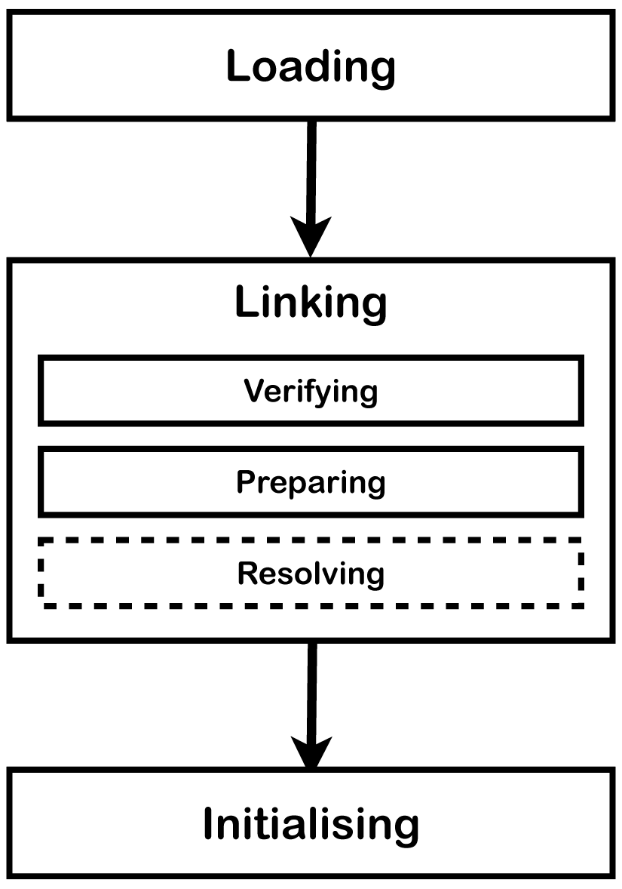

# Loading Linking Initialization

JVM은 부트스트랩 클래스로더를 사용하여 초기 클래스를 로드하여 시작됩니다. 그런 다음 `public static void main(String[])`이 호출되기 전에 클래스가 연결되고 초기화됩니다. 이 메서드를 실행하면 필요에 따라 추가 클래스 및 인터페이스의 로드, 연결 및 초기화가 차례로 실행됩니다.

<figure><figcaption></figcaption></figure>

## Loading

**`Loading`**은 특정 이름을 가진 클래스 또는 인터페이스 유형을 나타내는 클래스 파일을 찾아 바이트 배열로 읽는 프로세스입니다. 다음으로 바이트를 parsed하고 `Class` 객체를 나타내고 올바른 major 버전과 minor 버전이 있는지 확인합니다.direct 슈퍼클래스로 명명된 모든 클래스 또는 인터페이스도 로드됩니다. 이 작업이 완료되면 이진 표현에서 클래스 또는 인터페이스 객체가 생성됩니다.

## Linking

**`Linking`**는 클래스 또는 인터페이스를 사용하여 타입과 direct 슈퍼클래스 및 슈퍼인터페이스를 확인하고 준비하는 프로세스입니다. lining은 확인, 준비 및 선택적으로 해결하는 세 단계로 구성됩니다.

### Verifying

**`Verifying`**은 클래스 또는 인터페이스 표현이 구조적으로 정확하고 Java 프로그래밍 언어 및 JVM의 semantic 요구 사항을 준수하는지 확인하는 프로세스입니다. 예를 들어 다음 확인이 수행됩니다.

1. 일관되고 올바른 형식의 symbol 테이블
2. 재정의되지 않은 최종 메서드/클래스
3. 메서드에는 올바른 수와 매개변수 타입이 있습니다.
4. 바이트 코드는 스택을 잘못 조작하지 않습니다.
5. 변수는 읽기 전에 초기화됩니다
6. 변수는 올바른 타입의 값입니다.

확인 단계에서 이러한 검사를 수행하면 이러한 검사를 런타임에 수행할 필요가 없습니다. `Linking` 중 확인은 클래스 로딩 속도를 늦추지만 바이트 코드를 실행할 때 이러한 검사를 여러 번 수행할 필요가 없습니다.

### Perparing

**`Preparing`**에는 메서드 테이블과 같이 JVM에서 사용하는 정적 스토리지 및 모든 데이터 구조를 위한 메모리 할당이 포함됩니다. 정적 필드가 생성되고 기본값으로 초기화되지만 초기화의 일부만 발생하므로 이 단계에서는 초기화 프로그램이나 코드가 실행되지 않습니다.

### Resolving

**`Resolving`**은 참조된 클래스 또는 인터페이스를 로드하고 참조가 올바른지 확인하여 symbolic 참조를 확인하는 선택적 단계입니다. 이 시점에서 이것이 발생하지 않으면 symbolic 참조의 확인은 바이트 코드 명령에 의해 사용되기 직전까지 연기될 수 있습니다.

## Initialization

클래스 또는 인터페이스의 초기화는 클래스 또는 인터페이스 초기화 메서드`<clinit>` 실행으로 구성됩니다.&#x20;
