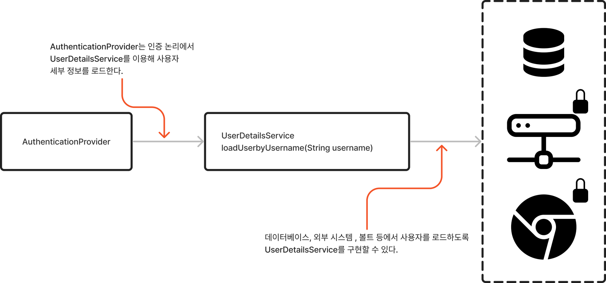

# Spring Security

<figure><figcaption>
스프링 시큐리티의 인증 프로세스에 포함한 주 구성요소와 이들 간의 관계
</figcaption></figure>

<figure><figcaption>
AuthenticationProvider는 인증 논리를 구현하고 UserDetailsService를 이용해 사용자 세부 정보를 로드하는 구성 요소이며 사용자 이름으로 사용자를 찾기 위해 loadUserByUsername(String username) 메서드를 호출한다
</figcaption></figure>

<figure><figcaption>
스피링 시큐리티의 인증 흐름, 여기에서는 JdbcUserDetailsManager를 UserDetailsService 구성 요소로 이용한다. JdbcUserDetailsManager는 데이터베이스를 이용해 사용자를 관리한다.
</figcaption></figure>

## 주 계약을 나타내는 인터페이스

<table><thead><tr><th width="248">설명</th><th>설명</th></tr></thead><tbody><tr><td>UserDetails</td><td>스프링 시큐리티가 관리하는 사용자를 나타낸다.</td></tr><tr><td>GrantedAuthority</td><td>애플리케이션의 목적 내에서 사용자에게 허용되는 작업을 정의한다(예: 읽기,쓰기,삭제 등)</td></tr><tr><td>UserDetailsService</td><td>사용자 이름으로 사용자 세부 정보를 검색하는 객체를 나타낸다</td></tr><tr><td>UserDetailsManager</td><td>UserDetailsService의 더 구체적인 계약이다. 사용자 이름으로 사용자를 검색하는 것 외에도 사용자 컬렉션이나 특정 사용자를 변경할 수도 있다</td></tr><tr><td>PasswordEncoder</td><td>암호를 암호화 또는 해시하는 방법과 주어진 인코딩된 문자열을 일반 텍스트 암호화 비교하는 방법을 지정한다</td></tr></tbody></table>

## Reference

> 책: 스프링 시큐리티 인 액션
